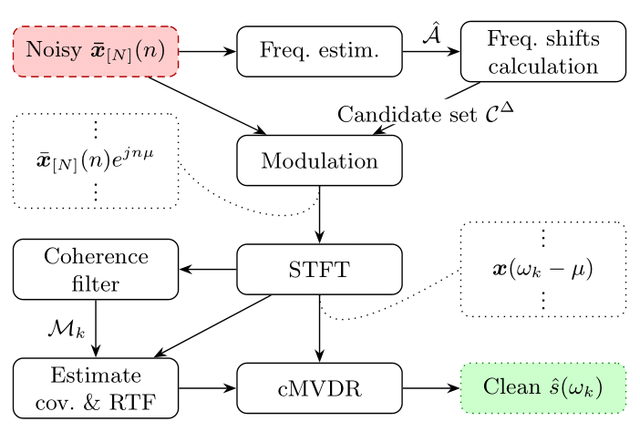

# cMVDR: Cyclic minimum-variance distortionless-response beamformer
Code accompanying the paper "cMVDR: Cyclic minimum-variance distortionless-response beamformer", 
to be submitted for publication.

<div align="center">
  
</div>

The paper proposes a new beamforming method leveraging the cyclostationarity of noise signals.  
By exploiting correlations across microphones and frequency components, the cyclic minimum-variance 
distortionless-response (cMVDR) beamformer achieves improved noise reduction, 
especially in low signal-to-noise ratio (SNR) scenarios.

---

## 📦 Installation

### 📋 Prerequisites
- Python 3.9+ (for compatibility with librosa)
- Tested on macOS 14.4.1 but should run on most Linux systems.

### 1️⃣ `pip` installation
The package is structured as a proper Python package and can be installed using pip:

1. Clone the repository:
```bash
git clone git@github.com:Screeen/cmvdr.git
cd cmvdr
```

2. Create and activate a Python virtual environment:
```bash
python3 -m venv .venv
source .venv/bin/activate  # On Windows: .venv\Scripts\activate
```

3. Install the package in editable mode:
```bash
pip install --upgrade pip
pip install -e .
```

This will automatically install all dependencies defined in `pyproject.toml`.

---

## ✅ Testing the installation

### 🔍 Verify package installation
After installation, verify that the package is properly installed:
```bash
python -c 'import cmvdr; print("cMVDR package successfully imported!")'
```

### 🧪 Running the tests
To verify the installation, run the provided tests:
```bash
python -m unittest discover -s tests
```

### 🚀 Running the quick demo
To quickly test the cMVDR implementation, run the demo script:
```bash
source script/run_demo.sh
```

## 🖥 Using `cmvdr` and `cmvdr-eval` from the command line
After installation, you can use the `cmvdr` and `cmvdr-eval` command line tools.
This is the easiest way to apply the cMVDR beamformer and evaluate its performance.
`cmvdr` runs the beamforming algorithm on a specified file or folder, while `cmvdr-eval` evaluates the quality of the output.
For usage instructions, run:
```bash
cmvdr --help
usage: cmvdr [-h] -i INPUT_PATH [-o OUTPUT_PATH] [-n NOISE_PATH] [-v]

Run cMVDR inference on a single file or a folder of audio files.

options:
  -h, --help            show this help message and exit
  -i INPUT_PATH, --input_path INPUT_PATH
                        Path to the input audio file or folder.
  -o OUTPUT_PATH, --output_path OUTPUT_PATH
                        Path to the output folder. If not provided, output will be saved in the same folder as input.
  -n NOISE_PATH, --noise_path NOISE_PATH
                        Path to the noise audio file or folder (optional, to estimate noise frequency). To match input
                        files, append _fileid_123.wav to the noise and the noisy files.
  -v, --verbose         If set, print detailed logs to the console.
```
and
```bash
cmvdr-eval --help
usage: cmvdr-eval [-h] -d FOLDER_DENOISED [-r FOLDER_REFERENCE] [--sort-by-snr]

Evaluate audio files in a folder.

options:
  -h, --help            show this help message and exit
  -d FOLDER_DENOISED, --folder_denoised FOLDER_DENOISED
                        Path to the folder containing denoised audio files.
  -r FOLDER_REFERENCE, --folder_reference FOLDER_REFERENCE
                        Path to the folder containing clean reference audio files (optional).
  --sort-by-snr         Sort results by SNR brackets (optional). Default is False.
```

## 🧪 Reproducing paper experiments

**📝 Note**: After installing the package with `pip install -e .`, you can run experiments directly from the repository root directory.

### ⚙️ Configurations
Experiment parameters are controlled via YAML files in the `configs/` folder. Edit `cmvdr.yaml` and `default.yaml` 
to set your desired parameters such as:
- `data_type` (choose from `synthetic` or `instruments`)
- `num_montecarlo_simulations`
- ... 

### ▶️ Running experiments

#### 🔬 Run synthetic data experiments:
  ```bash
  source script/run_synthetic.sh
  ```

#### 🎯 Run all experiments (synthetic and instruments):
```bash
source script/run_all.sh
```

#### ⚡ Or run the main experiment script directly:
```bash
python main.py --data_type synthetic  # or instruments
```

## 🎵 Get cMVDR output for your own audio files (inference with script)
To apply the cMVDR beamformer to your own audio files, you can use the inference script.
This script processes audio files in a specified folder and saves the output to another folder.

After installing the package, run:
```bash
python -m script.cmvdr_inference
```

Specify the folder containing audio files in the `configs/inference_cmvdr.yaml` YAML file:
```yaml
data:
  input_dir: ../datasets/test_cmvdr/noisy
  output_dir: ../datasets/test_cmvdr/noisy_output
```

As an alternative, you can run the script directly from the command line, using for example the demo audio files:
```bash
cmvdr --input_dir ./demos/noisy --output_dir ./demos/noisy_output
```

### 📝 Notes
Synthetic data experiments require downloading room impulse responses (RIRs) and clean speech:
- RIRs: https://www.iks.rwth-aachen.de/en/research/tools-downloads/databases/multi-channel-impulse-response-database/
- Speech: Speech Intelligibility CD by Neil Thompson Shade

Instrument data experiments also require downloading instrument samples:
- Instrument samples:  https://theremin.music.uiowa.edu/MIS.html.

## 🔧 Troubleshooting

### ⚠️ Cannot import `kaiser` from `scipy.signal`
If you get
```
ImportError: cannot import name 'kaiser' from 'scipy.signal' (.../.venv/lib/python3.X/site-packages/scipy/signal/__init__.py). Did you mean: 'kaiserord'?
```
Open the file
```
nano .../SVD-direct/env/lib/python3.X/site-packages/pysepm/util.py
```
and replace 
```
from scipy.signal import firls,kaiser,upfirdn
```
with
```
from scipy.signal import firls,upfirdn
from scipy.signal.windows import kaiser
```

### 🔄 Installing without uv
If you don't have `uv` installed or prefer using standard pip, use Method 1 above or:
```bash
python3 -m venv .venv
source .venv/bin/activate  # On Windows: .venv\Scripts\activate  
pip install --upgrade pip
pip install -e .  # Use -e for editable installation
```

### 📦 Package import issues after installation
If you installed the package with `pip install -e .` and have import issues, make sure:
1. Your virtual environment is activated
2. You're running Python from the correct environment
3. The installation completed without errors

You can verify the package is installed by running:
```bash
pip list | grep cmvdr
```

### 🔊 OSError: PortAudio library not found
Your Python package (`sounddevice` or something else that uses PortAudio) can’t find the underlying PortAudio C library on your system.
Installing the Python package alone isn’t enough — the native library must also be installed.
How you fix it depends on your OS. You can still run the experiments, but you won't be able to listen to the audio output.

### ❗ ImportError: numpy.core.multiarray
```
ImportError: numpy.core.multiarray failed to import (auto-generated because you didn't call 'numpy.import_array()' after cimporting numpy; use '<void>numpy._import_array' to disable if you are certain you don't need it).
-bash: read: `REPLY?Press enter to exit': not a valid identifier
```
This error can occur if you have an incompatible version of NumPy installed.
Run
```bash
pip install https://github.com/ludlows/python-pesq/archive/master.zip
```

---

> [!NOTE]
> Feedback and questions welcome: G.Bologni@tudelft.nl.
> Enjoy experimenting with cMVDR!
> 
